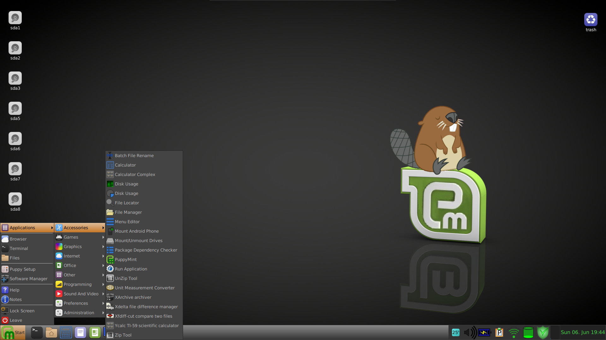
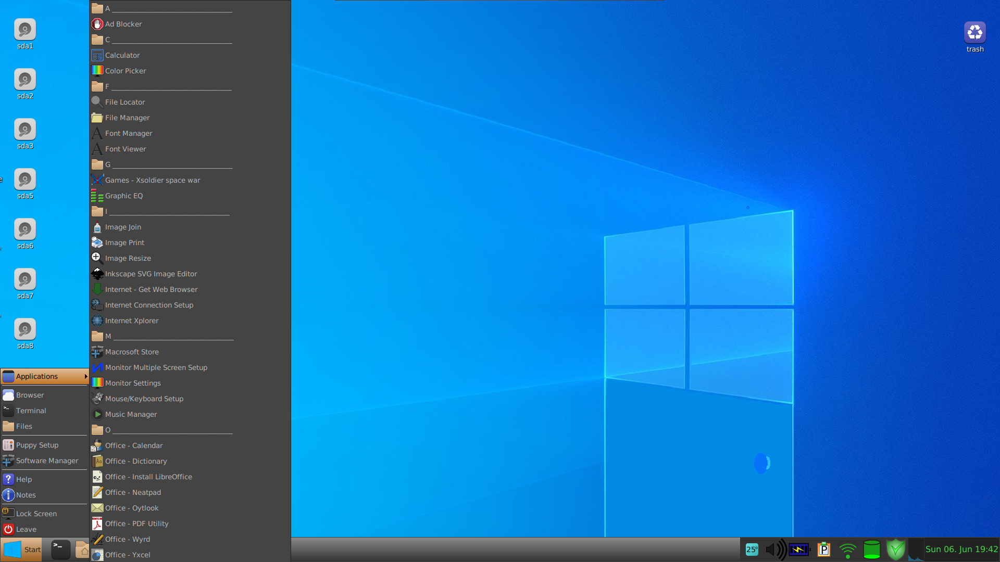

# puppymint
A Puppy Linux program that merges a Linux Mint Menu system, a Windows 10 like system, or a custom system.

Since this is a new project I would use it on a test system until you are satisfied it will do what you want.
Here is a basic layout of how the project works.

1) The program looks through all .desktop files in /usr/share/applications and notes whether the noDisplay  
    property is true or false, the name of the program, the location, and the categories and it writes a configuration
    file.  (It will explicitly set noDisplay to false it the progam is being displayed.
    The program makes a file called configuration.txt
    
2) There is a human readable file listing the program names, and the programs new name.
    This file is called nameChangeList.txt and is read in by a program and changes the names
    in the configuration file.
    
3) There is a human readable file with a list of names in it to be shown.
    This file is called applicationsShow.txt.  A program reads the configuration file and sets the display
    to true if the name is present, if absent, it sets display to true.

4) There is a human readable file with a list of categories to be added to puppy linux categories, so that 
    these categories will be added to the categories in the .desktop files.
    
5) There is a python program that processes the configuration file and makes all the changes to the .desktop files.

Additionally, basic copying of backgrounds, and some menu related icons are copied to the /usr/share/icons/hicolor/48x48/apps

This is a basic overview of how the program essentially works.  To recap, there is a configuration file that is initially made.  This configuration file is processed sequentially and then a program changes your .desktop files based on this configuration file.

There are 2 ways to run the program.  In the folder, there is a run.sh file that you could run right there and it should work.  There is also a file called installToSystem.sh, and I believe this is the better way to go.  Because it will copy a configuration file to your system in case you want to revert back to the original configuration.  Once you run installToSystem.sh, you should see the PuppyMint icon in your system and the program will run from there.

Basically, the first 3 options are what I would typically use and choose quiet when it prompts you.  You can also alter files as it installs, and you can do a full interactive installation.

Here is what is going on in the code:

There is a puppy folder - this contains all the original first run settings
There is a recent folder - this is a recent copy of your system
There is a folder for Linux Mint Bionic, Linux Mint Xenial (Fossapup)
There is a folder for Wyndows Bionic and Wyndows Xenial (Fossapup)

The program always looks in a temp folder to make a configuration file.  So if you say choose to install 
Linux Mint Bionic menus, it will copy the appropraiate folders into the temp folder, then process the temp folder.

If you want Wyndows/Xenial, it will copy that folder to temp, and process the temp folder.

If you choose interactive, it will copy piece by piece stuff into the temp folder, then process the temp folder.

If you choose custom, it will copy the custom folder into the temp folder, and process the temp folder.  So if you choose custom, you will need to make sure all the appropriate data is in that folder.  For convenience, that folder has sub folders named with the same name as the file that goes in them.  So you just go through each folder and fill them in.  Look at the other folders for examples.

The wyndows and mint folder names, and programs are not complete and a little underdeveloped, but they are just meant to show how it works.  You can alter these files in a text editor to customize your versions.

Here is some more info about the processing with input, processing, and output (IPO).  Although most are csv files, I named them with .txt convention, this way they don't constantly open up in a spreadsheet by default, because they are much easier to work on in a text editor.

collectApplicationData.py - takes /usr/share/applications/ and makes a configuration.txt file from the .desktop files

makeApplicationsShowNoAsk.py - looks at configuration.txt and makes applicationsShow.txt which lists applications to show.

nameNameChangeList.py - looks at current .desktop files and makes a name,name format that can be processed nameChangeList.txt

renameApplications.py - reads in nameChangeList.txt and switches one name for the other and rewrites configuration.txt

hideAllApplications.py - reads in configuration.txt and changes display to false and rewrites configuration.txt as output (used right before showApplications.py)

showApplications.py - reads in applicationsShow.txt and configuration.txt and changes display to true in configuration.txt if the program is present in applicationsShow.txt 

reorderApplications.py - reads in configuration.txt, orders by name, and rewrites sorted configuration.txt as output

processConfiguration.py - this is where just about all the action is taking place.  This program reads in the configuration.txt file, then goes into your system and changes all the .desktop files, their names, their categories, and whether or not they are shown.

The rest of the programming is basically writing jwm files(Joe's window manager), menu files (xdg), desktop-directory files, icons and backgrounds.

There is also a little bash script I wrote to read in the names of .desktop files, then it makes a menu out of the first letter of the name, that does not execute anything.  This way, if there is a program that begins with A for example, there will be an "A" heading present in the menu.

I have never written bash scripts before until this project, and have learned python less than 1 year ago, as I am going into my second year as a software engineer.  So I tried to keep the code as self-documenting as possible, and it is my nature to use simple programming style.

I am posting this project here so that some people can try it out and so I can get some feedback on the project.

The overall goal is to make the most usable systems on old computers so they can still be used and have some fun while doing it.

The source code is all available in the puppymint.tar.gz file in either bash scripts, text files, or python scripts.  I will more formally post them separately as the project develops more.

